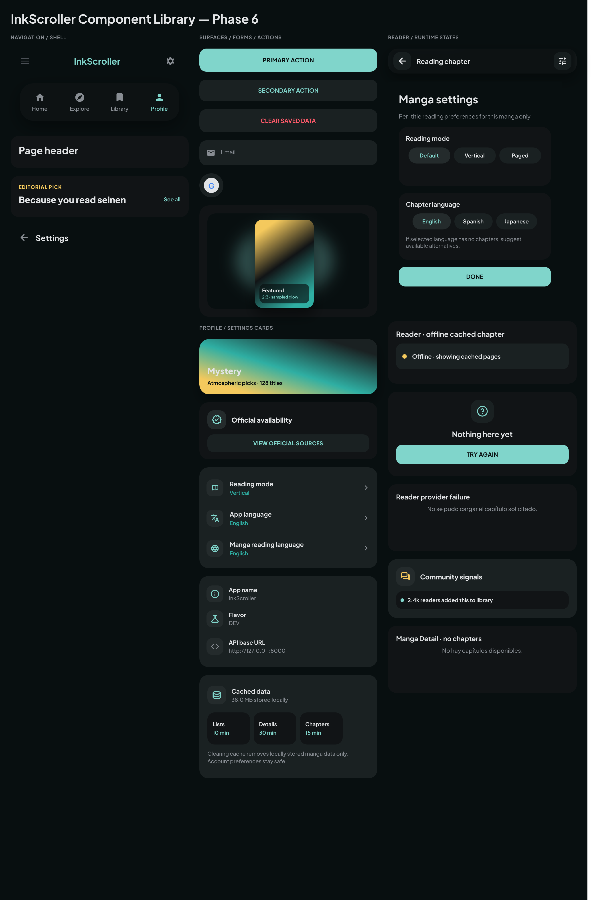

# InkScroller Component Library — Phase 6

This document captures the current Phase 6 component-library source of truth from Pencil. Use it as the visual review reference before implementing or updating Flutter widgets.

## Source of truth

| Item | Location |
|---|---|
| Editable Pencil file | `design/designApp.pen` |
| Component Library frame | `00 Component Library — InkScroller` (`Vmbnk`) |
| Exported review image | `design/images/Vmbnk.png` |
| System rules | `design/DESIGN.md` |

## Component groups

### Navigation and shell

- Topbar
- Floating bottom nav
- Page header
- Editorial section header
- Back bar

### Surfaces, forms, and actions

- Primary CTA
- Secondary tonal action
- Danger action
- Auth field
- Google provider button
- Manga cover card with sampled glow
- Genre gradient tile
- Official availability card
- Preference card
- Settings info card
- Cache card

### Reader and runtime states

- Reader top bar with glass controls
- Manga settings sheet
- Offline cached banner/card
- Empty/Error state CTA card
- Compact reader failure state
- Community teaser card
- Compact no-chapters state

## Implementation notes

- Dark mode remains the default visual source of truth.
- Components use Material 3-compatible icon direction: prefer `Material Symbols Rounded` equivalents when mapping to Flutter.
- Bottom navigation has been enlarged for readability: 24px icons, 12px labels, and an 84px glass pill.
- Visible component text should represent app UI, not implementation comments. Explanatory design notes were removed from the component board to avoid confusing design-to-code handoff.
- No full-screen redesign is implied by this document; this is the reusable component contract layer for later Flutter implementation.

## Review checklist

- [ ] Component matches the exported Pencil image.
- [ ] Text is user-facing or an intentional component label.
- [ ] Icons map cleanly to Material 3 / Flutter equivalents.
- [ ] Interactive controls preserve comfortable touch targets.
- [ ] Components use spacing and surface shifts instead of divider lines.
- [ ] Runtime states include clear copy and one obvious next action where applicable.

## Next step

Use this document and `design/designApp.pen` when implementing INK-98 in Flutter. Keep code implementation in separate work from Pencil design edits.
