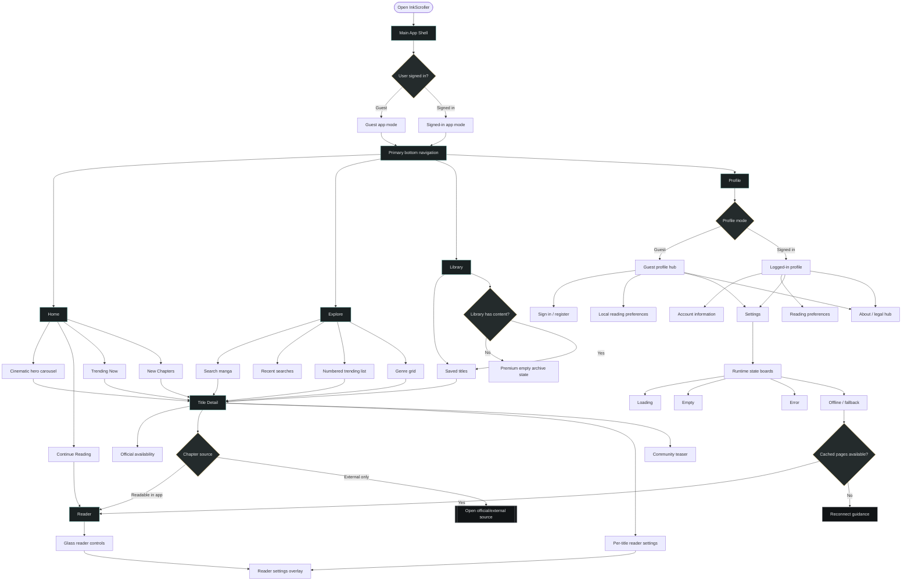

# InkScroller UX/UI Flow Diagram

This document is the canonical planning source for the product-level UX/UI flow diagram. It connects the Phase 6 visual refresh with the user journeys that reviewers, designers, and implementers need to reason about.

> Jira: [INK-83](https://devdigi.atlassian.net/browse/INK-83)  
> Design source of truth: [`design/DESIGN.md`](../../design/DESIGN.md) + `design/designApp`  
> Product source: [`docs/PRD/phase-6-visual-refresh.md`](../PRD/phase-6-visual-refresh.md)

> **Recommended editable source:** [`ux-ui-flow.drawio`](ux-ui-flow.drawio).  
> Mermaid remains useful as a textual sketch, but draw.io is the preferred artifact for this UX/UI flow because the product map needs manual layout control.

## Quick path

1. Open [`ux-ui-flow.drawio`](ux-ui-flow.drawio) in diagrams.net or the VS Code Draw.io extension.
2. Use the planning table to confirm the flow boundaries.
3. Keep the Mermaid source below as a lightweight textual sketch, not the primary review artifact.

## Diagram plan

| Area | Flow responsibility |
|------|---------------------|
| App entry | Start the user in the shell and account state check. |
| Main navigation | Keep Home, Explore, Library, and Profile as the primary product tabs. |
| Discovery | Let users browse editorial content, search, and open title detail. |
| Reading | Move from title detail to readable chapters, external chapters, or reader settings. |
| Account state | Show different Profile paths for guest and logged-in users without blocking app-level settings. |
| Support surfaces | Keep Settings and About reachable from Profile, not the bottom navigation. |
| Runtime states | Make loading, empty, error, and offline/fallback states first-class outcomes. |

## Mermaid source



## Review checklist

- [ ] The diagram keeps Settings and About under Profile, matching the Phase 6 navigation decision.
- [ ] Guest users can still access local preferences and support/legal surfaces.
- [ ] Title Detail clearly separates in-app reading from external/official source links.
- [ ] Offline/fallback behavior preserves cached reader access when available.
- [ ] The diagram remains documentation/tooling only; it does not require Flutter app code changes.

## Mermaid MCP setup

OpenCode now has a local MCP entry named `mcp-mermaid` in the user config:

```json
"mcp-mermaid": {
  "command": ["cmd", "/c", "npx", "-y", "mcp-mermaid"],
  "enabled": true,
  "type": "local"
}
```

Restart OpenCode after this change so the MCP server is discovered.
